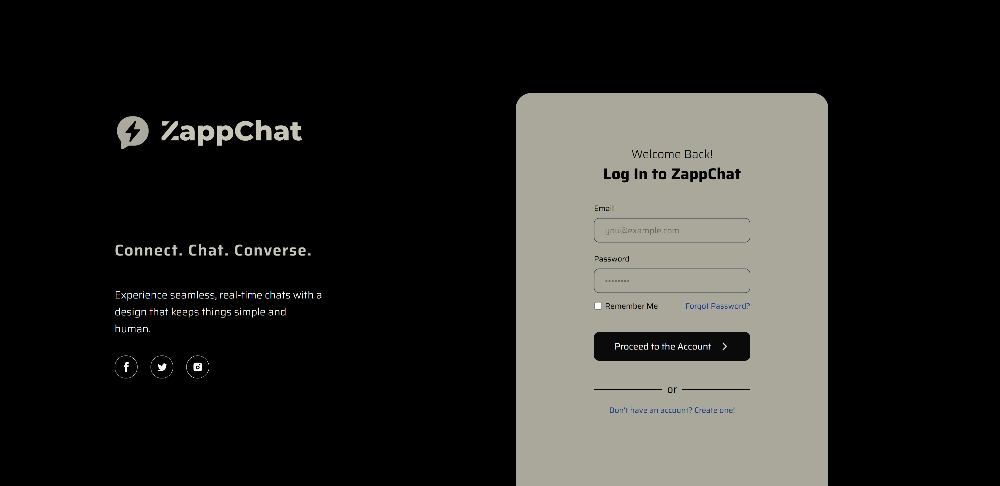
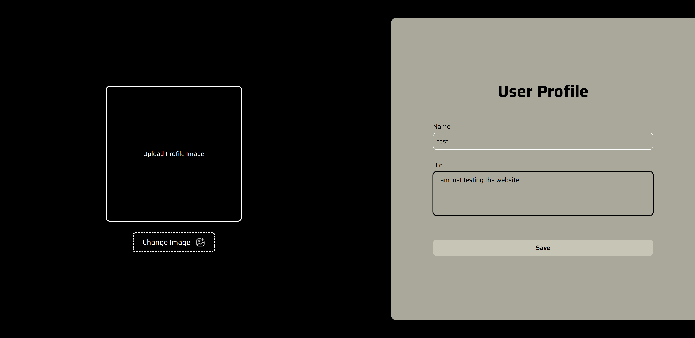
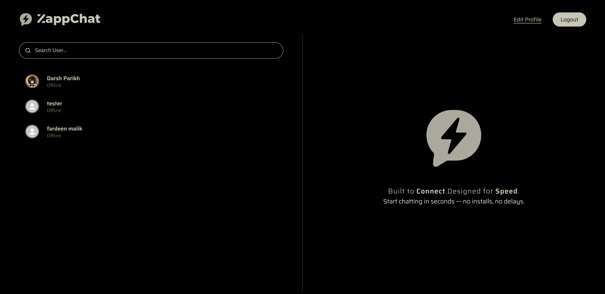
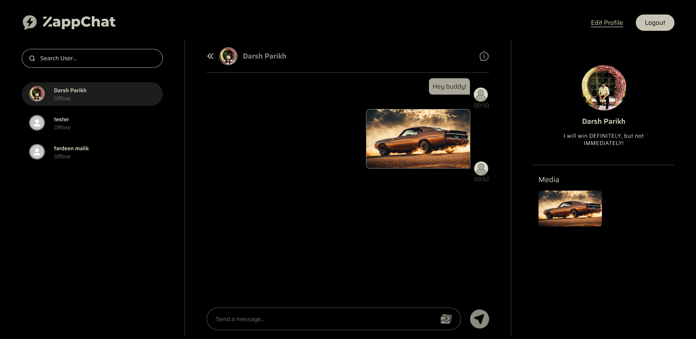

# ⚡ ZappChat

**ZappChat** is a modern SaaS-based real-time communication platform built using the MERN stack. It allows users to sign up, create profiles, and engage in one-on-one conversations — all in real time using Socket.IO. It ensures fast performance and a sleek, responsive UI

---

## 🌐 Live Demo

🚀 Try **[ZappChat](https://zappchat.onrender.com/)**

---

## 🛠️ Tech Stack

### 🔹 Frontend

- ⚛️ **ReactJS**
- ⚡ **Vite.js**
- 🎨 **TailwindCSS**
- 🔀 **React-Router**
- 🔗 **Axios**

### 🔹 Backend

- 🟩 **Node.js**
- 🚂 **Express.js**
- 🔐 **JWT** Authentication
- 🌍 **CORS**

### 🔹 Real-Time Communication

- 📡 **Socket.IO**

### 🔹 Database

- 🌿 **MongoDB**
- 🌿 **Mongoose ODM**

### 🔹 API

- 🖼️ **Cloudinary API**

### 🔹 Deployment
- 🚢 Hosted on **[Render](https://render.com)**

---

## ✨ Features

- 🔐 User Sign-up/Login with JWT
- 👤 Profile creation with image upload
- 💬 Real-time chat with text & image support via Socket.IO 
- 🖼️ Instantly display shared images in the dedicated media gallery for quick access and viewing
- 📱 Responsive UI using TailwindCSS
- ⚙️ Clean and modular MERN architecture

---

## 📁 Project Structure

ZappChat/ \
├── frontend/ \
│ ├── node_modules \
│ ├──  src/ \
│ │ ├── components \
│ │ │ ├── ChatOptionsSection.jsx \
│ │ │ ├── ChatSection.jsx \
│ │ │ ├── UserProfileSection.jsx \
│ │ │ └── Navbar.css \
│ │ ├── context \
│ │ │ ├── AppContext.jsx \
│ │ │ └── AppContextProvider.jsx \
│ │ ├── libs \
│ │ │ └── utils.js \
│ │ ├── pages \
│ │ │ ├── Home.jsx \
│ │ │ ├── Login.jsx \
│ │ │ ├── Profile.jsx \
│ │ │ └── SignUp.jsx \
│ │ ├── App.jsx \
│ │ ├── main.jsx \
│ │ └── index.css \
│ ├──  public/ \
│ ├── index.html \
│ ├── eslint.config.js \
│ ├── package-lock.json \
│ ├── package.json \
│ ├── vite.config.js \
│ └── .env \
├── backend/ \
│ ├── node_modules \
│ ├── middleware/ \
│ │ └── auth.js \
│ ├── routes/ \
│ │ ├── messageRoutes.js \
│ │ └── userRoutes.js \
│ ├── models/ \
│ │ ├── message.js \
│ │ └── user.js \
│ ├── lib/ \
│ │ ├── cloudinary.js \
│ │ ├── db.js \
│ │ └── utils.js \
│ ├── controllers/ \
│ │ ├── messageController.js \
│ │ └── userController.js \
│ ├── server.js \
│ ├── package-lock.json \
│ ├── package.json \
│ └── .env \
└── README.md

---

## ⚙️ Setup & Installation

### ✅ Prerequisites

- Node.js (v18+)
- MongoDB (local or Atlas)
- npm or yarn

---

### 🔐 Environment Variables

#### `backend/.env`

```env
PORT=your_backend_port \
NODE_ENV=your_setup_mode (development/production) \
MONGODB_URI=your_mongodb_connection_string \
JWT_SECRET=your_jwt_secret \
DEPLOYED_FRONTEND_URL=your_deployed_website_url (if frontend is deployed) \
CLOUDINARY_CLOUD_NAME=your_cloudinary_cloud_name \
CLOUDINARY_API_SECRET=your_cloudinary_api_secret \
CLOUDINARY_API_KEY=your_cloudinary_api_key
```

#### `frontend/.env`

```env
VITE_BACKEND_URL=your_backend_url
VITE_DEFAULT_CLOUDINARY_PROFILE_PIC_URL=your_default_profile_picture_url
```

---

## 🛠️ Running the App Locally

```bash
# Clone the repository
git clone https://github.com/DarshParikh25/ZappChat.git
cd ZappChat

# Start the backend
cd backend
npm install
npm run server

# Start the frontend
cd ../frontend
npm install
npm run dev
```

---

## 📸 Screenshots

### 🔐 Login Page



### 📝 Edit Profile Page



### 🏠 Home Page



### 💬 Chat Page



---

## 🤝 Contribution

Contributions, issues and feature requests are welcome!
Feel free to check issues page if you want to contribute.

```bash
# Fork the project
# Create your feature branch (git checkout -b feature/new-feature)
# Commit your changes (git commit -m 'Add new feature')
# Push to the branch (git push origin feature/new-feature)
# Open a Pull Request
```

---

## 📜 License

📝 This project is licensed under the MIT License.

See the [LICENSE](./LICENSE) file for details.

---

## 💬 Contact
For questions or feedback:

**Darsh Parikh**

- 💼 GitHub: [@DarshParikh25](https://github.com/DarshParikh25)
- 🔗 LinkedIn: [darshparikh](https://www.linkedin.com/in/darsh-parikh-66538a251)
- 📫 Email: darshparikh00@gmail.com 

---

## 🙌 Acknowledgements

- [Socket.IO Docs](https://socket.io/)
- [MongoDB Atlas](https://www.mongodb.com/products/platform/atlas-database)
- [TailwindCSS](https://tailwindcss.com/)
- [Render Hosting](https://render.com/)
- [Cloudinary](https://cloudinary.com/)

---

## 📬 Feedback

Have suggestions or questions? \
Feel free to open an issue.

> Made with ❤️ by **Darsh Parikh**